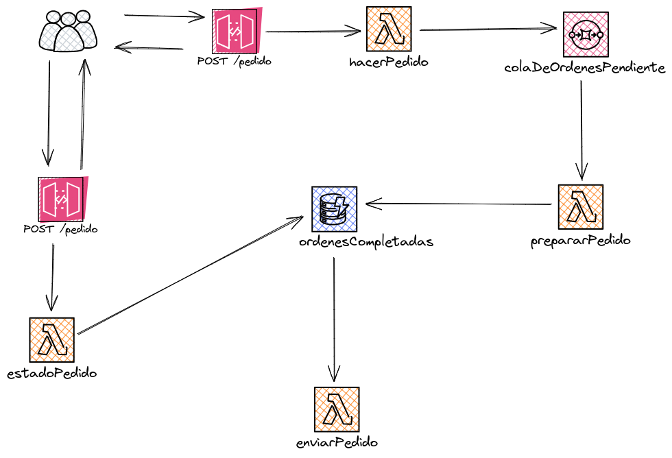

# Proyecto Serverless de Gestión de Pedidos

Este es un proyecto serverless en Python que proporciona una plataforma para gestionar pedidos. Utiliza servicios de AWS como Lambda, API Gateway, SQS y DynamoDB para manejar diferentes aspectos del flujo de pedidos, desde la colocación hasta la entrega.
El proyecto se basa en el curso: [Desarrollo de aplicaciones sin servidor en AWS](https://www.udemy.com/course/serverless-en-espanol/ "Desarrollo de aplicaciones sin servidor en AWS")

## Funcionalidades Principales

- **hacerPedido**: Los clientes pueden enviar solicitudes para realizar un nuevo pedido de pizza. El pedido se guarda en una cola SQS para su procesamiento posterior.
- **prepararPedido**: Una vez que se recibe un pedido en la cola, se procesa para prepararlo y luego se guarda en una tabla DynamoDB para su seguimiento.
- **enviarPedido**: Después de preparar un pedido, se marca como entregado en la tabla DynamoDB.
- **estadoPedido**: Los clientes pueden verificar el estado de su pedido proporcionando su ID de pedido, lo que devuelve el estado actual del pedido, ya sea "En Preparación", "Listo para Entrega" o "Entregado".

## Estructura del Proyecto

El proyecto tiene la siguiente estructura:
.
├── handler.py                # Código de las funciones Lambda
├── orderMetadataManager.py   # Gestión de pedidos en DynamoDB
└── serverless.yml            # Archivo de configuración de Serverless Framework

